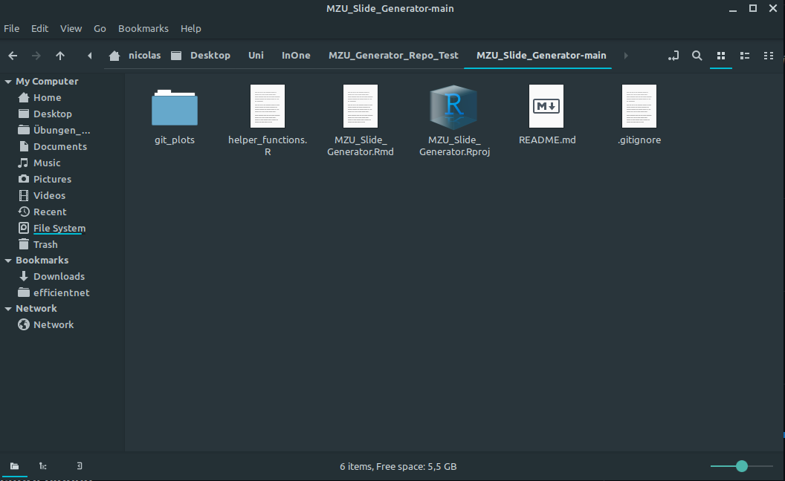
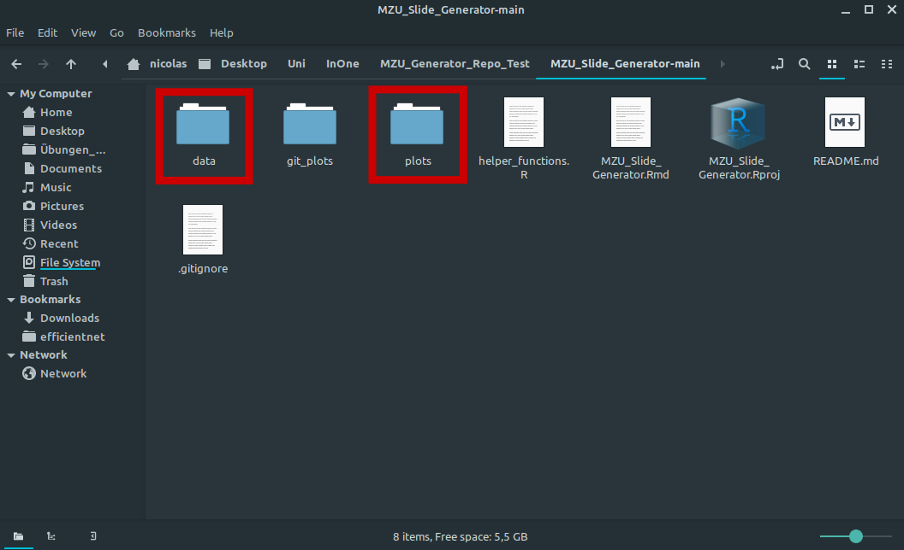
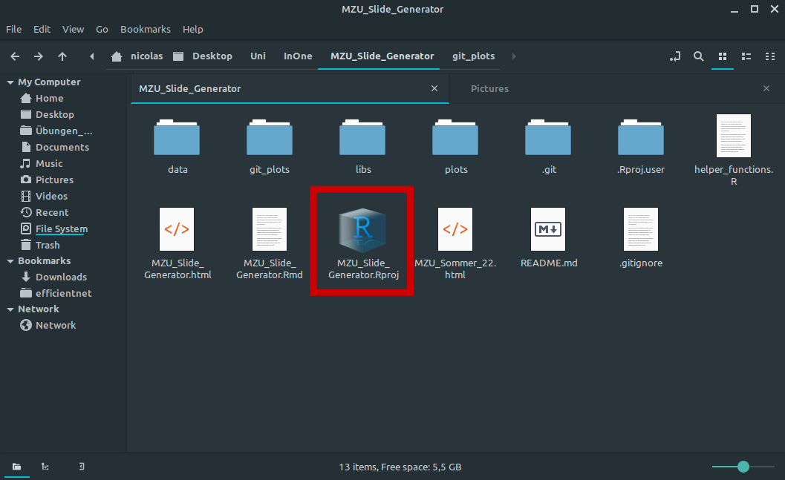
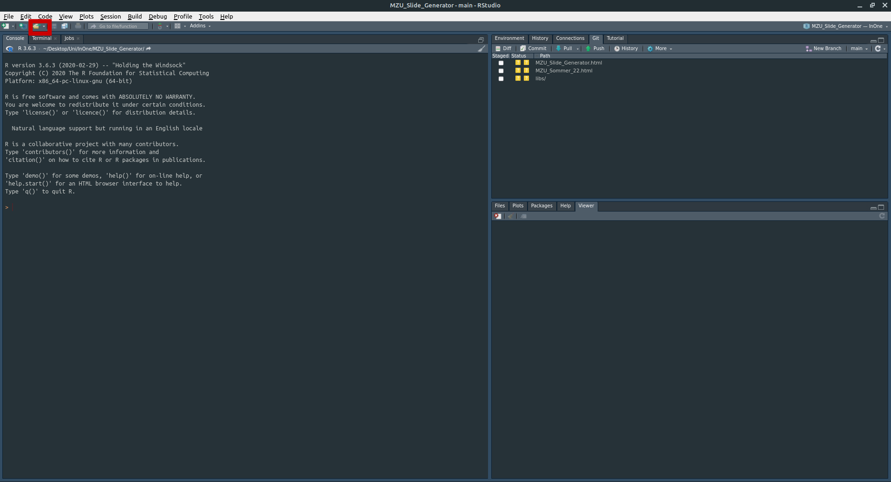
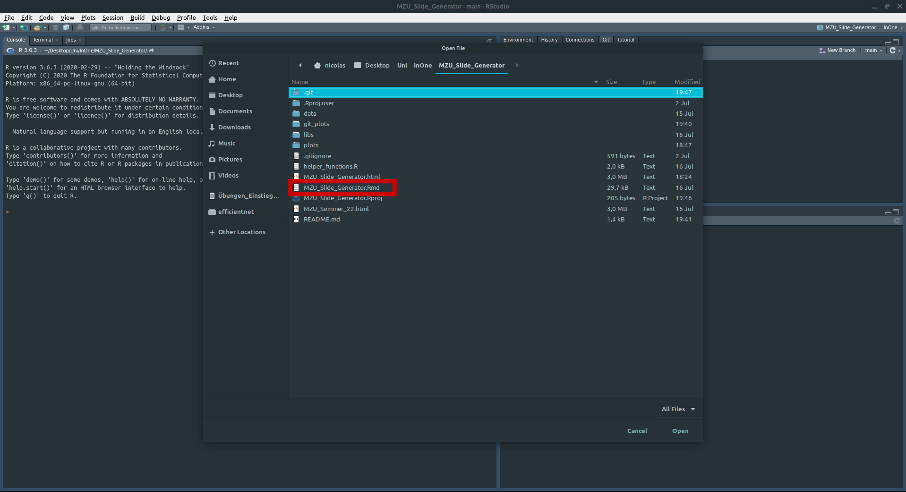
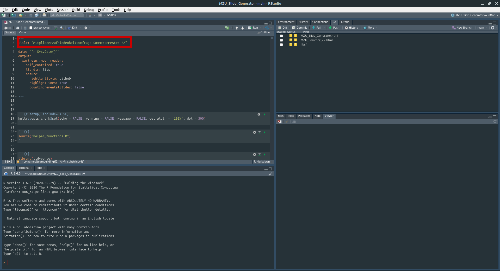
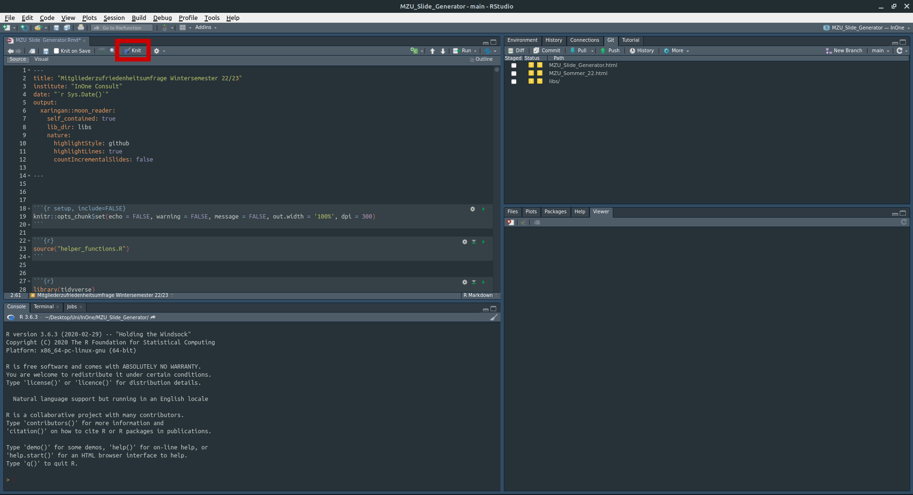

# MZU Slide Generator

## Ziel

## Verwendung

### Repository clonen

1. Downloade das Repository

Um den MZU-Slide-Generator zu verwenden, musst du die Dateien aus diesem Repository auf deinen PC herunterladen. 

2. Unzippe die heruntergeladene zip-Datei und öffne den erzeugten Ordner *MZU_Slide_Generator-main*. 

Der Inhalt des Ordners sollte wie folgt aussehen:

3. Innerhalb von *MZU_Slide_Generator-main* erstelle zwei Ordner namens *data* und *plots*

4. Lade die Ergebnisse der Umfrage herunter, die mit der Vorlage *MZU_Vorlage_MZU_Generator* erstellt wurde (https://docs.google.com/forms/d/1H9aMkMYazCJUuGxSp_PbZURgpABJs_KrQUux8jZMuRg/edit), in den Ornder *data* als *csv Datei* herunter. Verwende den Dateinamen *umfrage.csv* (Hintergrund: Das Script *MZU_Slide_Generator.Rmd* erwartet die Umfrage-Antworten in einer Datei namens *umfrage.csv*) 

5. Öffne das R-Projekt *MZU_Slide_Generator.Rproj* 

6. Öffne *MZU_Slide_Generator.Rmd* innerhalb von RStudio bzw. des Projekts *MZU_Slide_Generator.Rproj* 

7. Erzeuge die Ergebnis-Präsentation

- Nach den SChritten 1-6 sollte RStutio wie folt aussehen:

- Ändere den Titel der Präsentation

- Erzeuge die Slides durch einen Klick auf *Knit*

- Die erzeugten Slides werden unter *MZU_Slide_Generator.html* abgespeichert

- Die fertige Präsentation öffnet sich dur Doppel-Klick auf *MZU_Slide_Generator.html* in deinem Browser 

*MZU_Slide_Generator.html_2*

